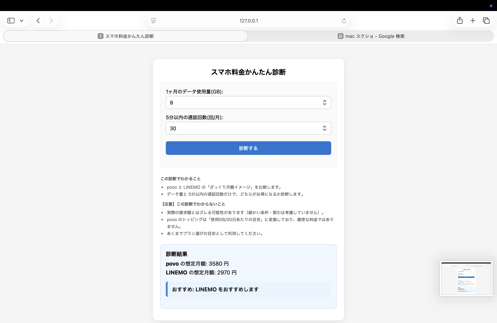

# スマホ料金診断（povo / LINEMO）
Pythonルールベースと機械学習による料金判定アプリ

## プロジェクト概要
本アプリは、スマホ料金診断を題材に、  
Pythonによるルールベース実装と機械学習モデルの両方を設計・実装・比較したWebアプリです。

同一の入力条件に対して、
- Pythonで記述した明示的な料金ルール
- 学習データから判定する分類モデル

の結果を比較できる構成にしています。

## アプリ機能一覧
- 「データ使用量」と「電話発信回数」を入力して料金診断
- povo と LINEMO のどちらが安いかを判定
- 診断ロジックをPythonで実装
- Web(Flask) から利用可能
- ルールベース判定と機械学習判定の比較

## デモ

※ Flask + HTML によるシンプルなUI

## 入力仕様
- data_gb: （例）8
- calls_5min: （例）30

## 出力仕様
- povo_cost / linemo_cost / recommended
- status（例: ok / unsupported）
- reason（unsupported の理由）

## 処理の流れ
1. GET リクエストでトップページを表示
2. フォーム送信時に POST リクエストを受信
3. Flask が入力値を検証、数値変換
4. 料金計算ロジック（Python）を実行
5. 判定結果をテンプレートに渡して描画

## 設計上の判断
- 入力とロジックは最小にして、料金診断フローを明確に見せることを優先しました。
- 通話は回数ベースの判定に限定し、分数ベース診断や24時間かけ放題の必要判定は現状未対応です。
- 未対応条件は例外でクラッシュさせず、status と reason でUI側に返します。
- ポートフォリオとして「動作すること」「設計判断が説明できること」を重視しています。

## ロジック概要
- povo: データトッピングを月額換算して近似し、条件を満たす候補から選びます。
- LINEMO: 条件を満たすプラン候補から見積もりを算出します。
- choose_best_plan: 料金比較と例外条件をまとめて判定し、UIに返却します。
- 機械学習: data_gb と calls_5min を特徴量とした二値分類モデルで判定します。

## 機械学習モデルの評価
- accuracy を指標としてモデル性能を確認
- ルールベース判定との乖離ケースを確認し、誤判定の要因を分析
- 本プロジェクトではモデル精度よりも、特徴量設計と判定ロジックの比較を重視

## 技術スタック
- Python / scikit-learn / Flask / HTML 

## 工夫した点
- 料金診断ロジックを Web 層から分離し、単体テスト・学習データ生成に再利用可能な構成にした
- 未対応条件を例外ではなく status / reason として返す設計にした

## 構成
- csv/
- images/
- js/
- templates/
- app.py
- choose_best_plan_v2.py
- make_training_data.py
- training_best_plan.py

## 制約対象外
- （例）30GBを超える場合は未対応（status=unsupported）
- 通信品質・エリア等の評価は扱いません

## 将来、拡張
- 発信分数ベースの詳細な通話料金計算
- 24時間かけ放題プランの必要判定
- プランの追加
- テストの自動化

## 使い方
### 1) セットアップ
```bash
python -m venv .venv
source .venv/bin/activate
pip install -r requirements.txt
```

### 2) 起動
```bash
python app.py
```

### 3) アクセス
- http://127.0.0.1:5000