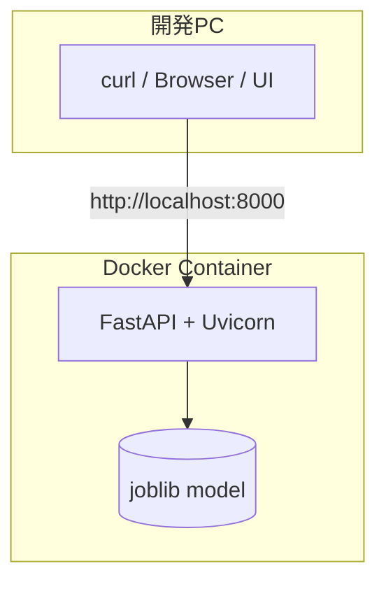

## プロジェクト概要

本プロジェクトは、携帯販売店舗における顧客からの質問文を入力として、
問い合わせ内容のカテゴリを自動分類するテキスト分類システムである。

実店舗での一次受付・問い合わせ振り分け業務を想定し、
機械学習モデルの構築から API 化までを一貫して実装している。

## 想定ユースケース（業務視点）

- 店舗スタッフが顧客の質問を聞き取る
- API に質問文を入力
- 問い合わせカテゴリを即座に判定
- 対応フロー（料金 / MNP / 端末説明）を切り替える
- 確信度が低い場合は人による確認へエスカレーション

## データ設計の考え方

本データは、携帯販売の現場で実際に発生する質問をもとに、
自分自身で作成したラベル付きデータである。

特に、MNP と料金の境界が曖昧な質問を意図的に含めることで、
実運用に近い分類タスクとなるよう設計している。

## モデル概要と評価

- モデル: Logistic Regression
- 特徴量: char n-gram（日本語特性を考慮）
- タスク: 日本語FAQ文書のカテゴリ分類

特に「解約・MNP」カテゴリでは高い再現率を示し、
一次受付・振り分け用途として十分な性能を確認できた。

## API化（FastAPI）

学習済みモデルを FastAPI を用いて Web API として提供している。
モデル単体ではなく、実運用を想定したシステム構成まで含めて実装した。

| Method | Path | 内容 |
|------|------|------|
| GET | /health | サーバー・モデル状態確認 |
| POST | /predict | 問い合わせ文のカテゴリ分類 |

サーバーおよびモデルのロード状態を確認するためのエンドポイント。

レスポンス例:
```json
{
  "status": "ok",
  "model_loaded": true
}
```
---

### POST /predict

```md
顧客の質問文を入力として、問い合わせカテゴリを予測する。
確信度が低い場合は人による確認を促す設計としている。
```

**Request**
```json
{
  "text": "MNPしたら解約金はいくらですか？"
}
```

**Response**
```json
{
  "label": "解約・MNP",
  "confidence": 0.62,
  "needs_review": true
}
```

**レスポンス項目**
- label: 予測された質問カテゴリ
- confidence: モデルの予測確信度（最大確率）
- needs_review: 確信度が閾値未満の場合に true

## API設計の意図

本APIは「完全自動化」ではなく、
店舗業務の一次振り分けを支援することを目的としている。

- 高確信度 → 自動対応
- 低確信度 → 人による確認

機械学習と人間判断を組み合わせた設計としている。

## 実行方法（ローカル / Docker）

本APIは **ローカル環境（venv）** でも **Docker環境** でも起動できます。 
目的に応じて使い分けます。

#### 1) 依存関係インストール
```bash
python -m venv .venv
source .venv/bin/activate
pip install -r requirements.txt
```

#### 2) サーバー起動
```bash
uvicorn app.main:app --reload
```

#### 3) 動作確認
- ヘルスチェック
```bash
curl -s http://127.0.0.1:8000/health | jq
```

- 推論
```bash
curl -s -X POST "http://127.0.0.1:8000/predict" \
-H "Content-Type: application/json" \
-d '{"text":"MNPしたら解約金はいくらですか？"}' | jq
```

#### Swagger UI
```bash
http://127.0.0.1:8000/docs
```

### システム構成

本システムは「問い合わせ文 → カテゴリ分類」を行う軽量な推論APIである。  
FastAPI がリクエストを受け取り、起動時にロードした学習済みモデル（joblib）で推論を実行する。

確信度（confidence）が閾値未満の場合は `needs_review=true` を返し、
完全自動化ではなく「一次振り分け + 人の確認」を前提にした運用を想定している。



## まとめ（ポートフォリオとしての位置づけ）

本プロジェクトは、  
単なる機械学習モデルの作成ではなく、

- **業務課題の定義**
- **データ設計・ラベル設計**
- **モデル構築・評価**
- **API化による実運用想定**
- **人による確認を前提とした業務設計**

までを一貫して行った点に特徴があります。

特に、携帯販売という実務領域において、
「質問を聞いた瞬間に、どの説明フローに進むか」
という現場の意思決定をそのまま分類タスクとしてモデル化し、

- 境界が曖昧な質問をあえて含めたデータ設計
- 確信度に基づく **人手介入（needs_review）** の仕組み
- FastAPI + Docker による再現可能な実行環境

を実装しました。

これは **精度だけを追う機械学習** ではなく、  
**実務で「使われる」ことを前提とした設計**を意識した取り組みです。

今後は、
- データ拡充による精度改善
- ラベル追加・マルチラベル化
- LLMとの組み合わせによる回答生成
- 本APIを組み込んだ業務支援ツール化

などを通じて、
より実運用に近い形へ発展させていく予定です。

本プロジェクトは、
**「現場理解 × データ × 機械学習 × API」**
を一つの成果物としてまとめたポートフォリオです。