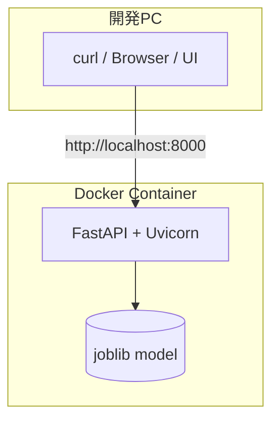

## プロジェクト概要

携帯販売店舗における顧客の質問文を入力として、
問い合わせカテゴリを自動分類するテキスト分類システム。

単なるモデル実装ではなく、
- 業務課題の定義
- データ設計
- モデル構築
- API化
- Dockerによる再現環境構築
- 人手介入を前提とした運用設計

までを一貫して実装したポートフォリオ。

## 想定ユースケース（業務視点）

- 店舗スタッフが顧客の質問を聞き取る
- API に質問文を入力
- 問い合わせカテゴリを即座に判定
- 対応フロー（料金 / MNP / 端末説明）を切り替える
- 確信度が低い場合は人による確認へエスカレーション

## データ設計の考え方

本データは、携帯販売の現場で実際に発生する質問をもとに、
自分自身で作成したラベル付きデータである。

特に、MNP と料金の境界が曖昧な質問を意図的に含めることで、
実運用に近い分類タスクとなるよう設計している。

## モデル概要と評価

- モデル: Logistic Regression
- 特徴量: char n-gram（日本語特性を考慮）
- タスク: 日本語FAQ文書のカテゴリ分類

特に「解約・MNP」カテゴリでは高い再現率を示し、
一次受付・振り分け用途として十分な性能を確認できた。

### 評価結果（テストデータ）

Accuracy: 0.70  
Macro F1: 0.70  

カテゴリ別F1:
- 料金: 0.72
- 端末・機種変更: 0.67
- 解約・MNP: 0.73

## API化（FastAPI）

学習済みモデルを FastAPI を用いて Web API として提供している。
モデル単体ではなく、実運用を想定したシステム構成まで含めて実装した。

| Method | Path | 内容 |
|------|------|------|
| GET | /health | サーバー・モデル状態確認 |
| POST | /predict | 問い合わせ文のカテゴリ分類 |

サーバーおよびモデルのロード状態を確認するためのエンドポイント。

レスポンス例:
```json
{
  "status": "ok",
  "model_loaded": true
}
```
---

### POST /predict

```md
顧客の質問文を入力として、問い合わせカテゴリを予測する。
確信度が低い場合は人による確認を促す設計としている。
```

**Request**
```json
{
  "text": "MNPしたら解約金はいくらですか？"
}
```

**Response**
```json
{
  "label": "解約・MNP",
  "confidence": 0.62,
  "needs_review": true
}
```

## レスポンス仕様

本APIは、問い合わせ文を分類し、以下の情報を返却します。

### 必須項目

- `label` (string)  
  予測された問い合わせカテゴリ。  
  業務フローの分岐に使用される主要な出力。

- `needs_review` (boolean)  
  人による確認が必要かどうかを示すフラグ。  
  以下の場合に `true` となる。
  - 確信度（confidence）が 0.65 未満の場合
  - モデルが `predict_proba` を持たず、確信度を算出できない場合
  - `needs_review` は `CONFIDENCE_THRESHOLD`（デフォルト 0.65）を基準に判定します。モデルが確率出力（`predict_proba`）を持たない場合は、人確認が必要として `True` を返します。

### 任意項目

- `confidence` (float | null)  
  最大予測確率。  
  モデルが `predict_proba` を持つ場合のみ返却される。  
  それ以外の場合は `null`。

- `candidates` (array | null)  
  上位3件の予測候補と確率の一覧。  
  モデルが `predict_proba` を持つ場合のみ返却される。  
  各要素は以下の形式。

  - `label` (string): 候補カテゴリ名  
  - `proba` (float): 予測確率

## API設計の意図

本APIは完全自動化を目的としていない。
実務上の誤分類リスクを考慮し、
信頼度に応じて人間判断へエスカレーションする設計とした。

- 高確信度 → 自動対応
- 低確信度 → 人による確認

機械学習と人間判断を組み合わせた設計としている。

## API設計メモ（実装意図）

### モデルのロード方法
- 学習済みモデルのロード（`joblib.load`）はディスクI/Oを伴い重いため、リクエストごとにロードせず、アプリ起動時（startup）に1回だけロードしています。
- ロードしたモデルは `app.state.model` に保持し、推論時はメモリ上のモデルを再利用します。

### `app.state` を使う理由（globalを避ける理由）
- `global` 変数で状態を保持すると依存関係が暗黙になり、テストや将来の拡張（複数モデル、差し替え等）が難しくなります。
- `app.state` は FastAPI アプリに紐づく状態管理の仕組みで、アプリ単位でモデルを保持でき、設計上の見通しが良くなります。

### 入力バリデーション（Pydantic）
- リクエストボディは `BaseModel` でスキーマ定義し、FastAPIにより自動的に検証されます。
- 例：`text` は必須かつ2文字以上（`min_length=2`）の制約があり、違反時はエンドポイント処理前に 422 が返ります。

### レスポンス仕様
- `label`（必須）: 予測カテゴリ（業務フローの分岐に使用）
- `needs_review`（必須）: 人確認が必要かどうかのフラグ
- `confidence`（任意）: `predict_proba` が利用可能な場合のみ最大確率を返します（それ以外は `null`）
- `candidates`（任意）: `predict_proba` が利用可能な場合のみ上位3候補（label/proba）を返します

### `needs_review` の判定ルール
- モデルが `predict_proba` を持つ場合: `confidence < CONFIDENCE_THRESHOLD` なら `true`
- モデルが `predict_proba` を持たない場合: 確信度を算出できないため `true`
- 閾値（`CONFIDENCE_THRESHOLD`）は運用で調整しやすいよう `config` に切り出しています（デフォルト 0.65）

### HTTPステータスの考え方
- 400: 入力が空など、クライアント起因の不正リクエスト
- 422: スキーマ違反（Pydanticバリデーションにより自動返却）
- 500: モデル未ロードなど、サーバ側の準備不足

## アーキテクチャ / 構成

本プロジェクトは **学習 → モデル保存 → API推論 → UI表示** を、Docker上で一貫して実行できる構成になっています。

- `train`（任意実行）: 学習を実行し、学習済みモデルを `/app/model` に保存
- `api`（常駐）: 保存済みモデルを読み込み、`/predict` で推論を提供
- `ui`（常駐）: Streamlit から API を呼び出し、結果を表示

### 構成図（Mermaid）

```mermaid
flowchart LR
  user[User / Browser] --> ui[Streamlit UI\n:8501]
  ui -->|HTTP| api[FastAPI API\n:8000]

  api -->|load on startup| model[(Model files\n./model -> /app/model)]

  data[(Dataset\n./data -> /app/data)] --> train[Train job\n(docker compose run --rm train)]
  train -->|save| model
```

## 実行方法（ローカル / Docker）

本APIは **ローカル環境（venv）** でも **Docker環境** でも起動できます。 
目的に応じて使い分けます。

#### 1) 依存関係インストール
```bash
python -m venv .venv
source .venv/bin/activate
pip install -r requirements.txt
```

#### 2) サーバー起動
```bash
uvicorn app.main:app --reload
```

#### 3) 動作確認
- ヘルスチェック
```bash
curl -s http://127.0.0.1:8000/health | jq
```

- 推論
```bash
curl -s -X POST "http://127.0.0.1:8000/predict" \
-H "Content-Type: application/json" \
-d '{"text":"MNPしたら解約金はいくらですか？"}' | jq
```

## Docker実行（推奨）

### 1) 学習（任意）
```bash
docker compose run --rm train
```

### 2) API + UI 起動
```bash
docker compose up --build
```
### 3) 動作確認

| サービス | URL | 説明 |
|-----------|-------------------------------|---------------------------|
| API (Swagger) | http://localhost:8000/docs | 推論APIのテスト |
| UI (Streamlit) | http://localhost:8501 | 分類デモ画面 |


ブラウザから分類デモを実行できます。

※ 推奨実行方法は Docker です。
ローカル環境差によるライブラリ不一致を防ぐため、
Docker環境での実行を前提としています。

## デモ（APIレスポンス例）

以下は `/predict` の実行例です。


- label: 予測カテゴリ
- confidence: 最大確率
- needs_review: 閾値未満なら true（人の確認推奨）

## Docker構成（なぜこうしているか）

### 目的
- ローカル環境差（Python / scikit-learn / Sudachiなど）による再現性問題を避ける
- 「学習」「推論API」「UI」を分離して、実運用に近い形にする

### 設計ポイント
- `./model` をボリューム共有し、**trainが作ったモデルをapiが読む**構成
- APIは起動時にモデルをロード（毎回ロードしない）
- UIは `http://api:8000` を呼ぶ（composeネットワーク内のサービス名解決）

#### Swagger UI
```bash
http://127.0.0.1:8000/docs
```

### システム構成

本システムは「問い合わせ文 → カテゴリ分類」を行う軽量な推論APIである。  
FastAPI がリクエストを受け取り、起動時にロードした学習済みモデル（joblib）で推論を実行する。

確信度（confidence）が閾値未満の場合は `needs_review=true` を返し、
完全自動化ではなく「一次振り分け + 人の確認」を前提にした運用を想定している。


```mermaid
flowchart TB
    subgraph Local[開発PC]
      C[curl / Browser / UI]
    end 
    subgraph Docker[Docker Container]
      API[FastAPI + Uvicorn]
      M[(joblib model)]
      API --> M
    end 
    C -->|http://localhost:8000| API
```

### 再現性について

本プロジェクトでは、
学習時と推論時で scikit-learn のバージョン不一致により
推論エラーが発生した経験を踏まえ、

- Pythonバージョン固定
- ライブラリバージョン固定
- Dockerによる環境統一

を徹底している。

## まとめ

本プロジェクトは、  
単なる機械学習モデルの作成ではなく、

- **業務課題の定義**
- **データ設計・ラベル設計**
- **モデル構築・評価**
- **API化による実運用想定**
- **人による確認を前提とした業務設計**

までを一貫して行った点に特徴があります。

特に、携帯販売という実務領域において、
「質問を聞いた瞬間に、どの説明フローに進むか」
という現場の意思決定をそのまま分類タスクとしてモデル化し、

- 境界が曖昧な質問をあえて含めたデータ設計
- 確信度に基づく **人手介入（needs_review）** の仕組み
- FastAPI + Docker による再現可能な実行環境

を実装しました。

これは **精度だけを追う機械学習** ではなく、  
**実務で「使われる」ことを前提とした設計**を意識した取り組みです。

今後は、
- データ拡充による精度改善
- ラベル追加・マルチラベル化
- LLMとの組み合わせによる回答生成
- 本APIを組み込んだ業務支援ツール化

などを通じて、
より実運用に近い形へ発展させていく予定です。

本プロジェクトは、
**「現場理解 × データ × 機械学習 × API」**
を一つの成果物としてまとめたポートフォリオです。